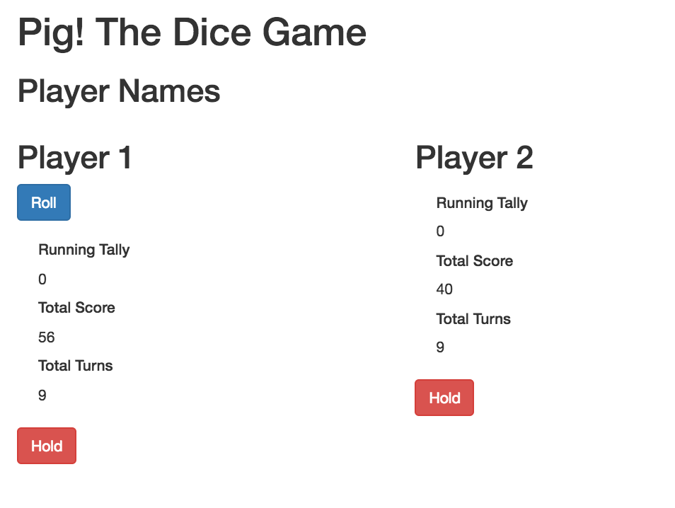

## Project Name
Pig Dice

## Features
Allows a player to play the Pig Dice game against another player.

## Technologies
JavaScript, JQuery, BootStrap, HTML and CSS

## Usage
To view the site, you can go to https://mehequanna.github.io/pig-dice.

To use the code, you can clone the repository at [https://github.com/jryanconklin/pig-dice](https://github.com/jryanconklin/pig-dice).

1. Download the repository.
2. Open index.html in your browser.

## Specifications

1. It can take a die roll.
- Input Example: 1
- Output Example: Turn Ends

2. A Die is Rolled
- Input Example: [2-6]
- Output Example: Score Tallied, Given Option to Hold or Continue

3. On Continue - Roll Again
- Input Example: 1
- Output Example: Turn Ends, Score is Cleared

4. On Continue - Roll Again
- Input Example: [2-6]
- Output Example: Score Tallied, Given Option to Hold or Continue

5. On Hold Selected
- Input Example: Enter
- Output Example: Score is Pushed to Player Score Total

6. Score is 100 or More
- Input Example: Player score >= 100
- Output Example: Game ends.

## Author/s
Stephen Emery & J. Ryan Conklin

##License
This work can be used under the MIT License.
Copyright (c) 2016 J. Ryan Conklin & Stephen Emery
